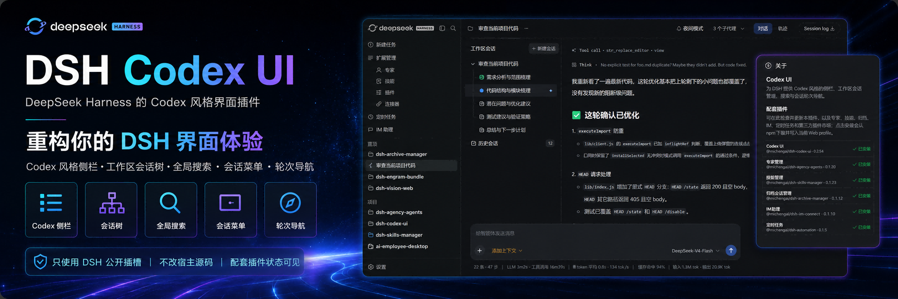
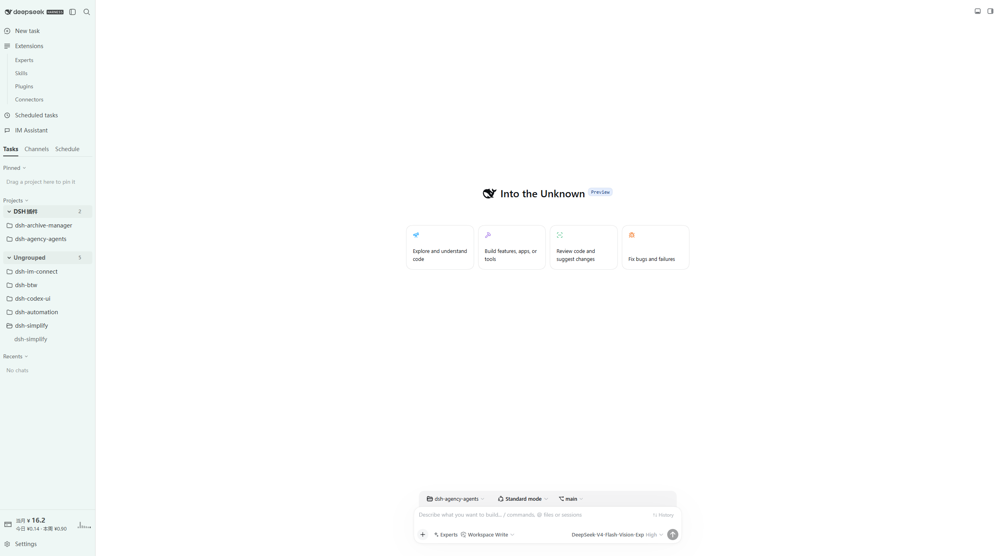

<p align="center">
  
</p>

<div align="center">

  # DSH Codex UI

  **为 DeepSeek Harness Web 重构 Codex 风格侧栏、工作区会话树、全局搜索和轮次导航**

  [English](README.md) · [更新日志](CHANGELOG.zh-CN.md) · [Apache-2.0](LICENSE)

  [](LICENSE)
  [](https://www.npmjs.com/package/@michengai/dsh-codex-ui)
  [](https://www.npmjs.com/package/@michengai/dsh-codex-ui)
  [](https://github.com/MichengAI/dsh-codex-ui)
  [](https://nodejs.org/)

</div>

> DSH Codex UI 是社区维护的 DeepSeek Harness（DSH）插件，并非 DeepSeek AI 官方产品。它只使用 DSH 公开插槽，不修改宿主源码或会话数据。

## 功能概览

- 通过官方 `sidebar` 插槽替换默认侧栏，并保留 `sidebar.workspaces`、`sidebar.settings` 和 `sidebar.footer.action`。
- 提供 Codex 风格顶栏：品牌标识、侧栏折叠和全局搜索。
- 工作区与会话支持展开折叠、拖拽排序、项目置顶、未读圆点和运行状态。
- 项目和会话菜单支持重命名、置顶、未读、归档、派生、打开目录、复制和删除。
- 调整会话列与输入卡片视觉，并为当前会话提供紧凑轮次导航。
- 在「设置 → 关于」展示配套插件状态，并可从 npm 安装缺失项。

## 界面预览

浅色主题：Codex 风格侧栏、工作区会话树和会话列。



深色主题：同一布局，使用 Codex 暗色令牌。


会话菜单：重命名、置顶、未读、归档、派生、复制和删除。


「设置 → 关于」列出配套插件及其安装状态。


## 前置条件

- 已可正常运行 DeepSeek Harness Web，且可在 PowerShell 中使用 `dsh`。
- 以下示例使用 `web` profile；请替换为实际目标 profile。
- 从源码安装或二次开发需要 Node.js 22+ 与 pnpm；仅从 npm 安装无需在任意目录执行 `pnpm install`。

## DSH 产品生态

Codex UI 既可以独立安装，也可以随桌面端一起使用。它们共享同一个 DSH 核心，但面向不同的使用方式：

| 产品 | 与 Codex UI 的关系 |
| --- | --- |
| [DeepSeek Harness](https://github.com/deepseek-ai/deepseek-harness) | Codex UI 的运行宿主，提供模型、会话、工具和插件系统 |
| [DSH Codex Desktop](https://github.com/MichengAI/dsh-codex-desktop) | 下载安装即用的桌面产品，已内置 Codex UI 和其他 5 个功能产品 |
| 6 个功能产品 | [Codex UI](https://github.com/MichengAI/dsh-codex-ui) · [IM Connect](https://github.com/MichengAI/dsh-im-connect) · [Automation](https://github.com/MichengAI/dsh-automation) · [Skills Manager](https://github.com/MichengAI/dsh-skills-manager) · [Archive Manager](https://github.com/MichengAI/dsh-archive-manager) · [Agency Agents](https://github.com/MichengAI/dsh-agency-agents) |

## 安装

`dsh plugin add` 会转发到 profile 目录里的 `pnpm add`。不写版本、不指定官方源时，本机镜像和最短发布间隔可能让你停在旧版。

### 交给其他 Agent 一句话安装 Codex UI

把下面这句话复制到 DSH、Codex 或 WorkBuddy，让它代你安装到本机 `web` profile。

```text
请把 DSH 插件 @michengai/dsh-codex-ui 最新版装进本机 web profile，使用官方 npm 源执行：dsh plugin --profile web add @michengai/dsh-codex-ui@latest --registry=https://registry.npmjs.org/。装完执行 dsh --profile web --dump-config，确认已挂载 codex-ui，并提醒我重启 DSH Web 后硬刷新浏览器。
```

| 产品 | 怎么用 |
| --- | --- |
| DSH | 把上面这句话发给当前会话。 |
| Codex | 把上面这句话发给 Codex，让它在本机执行安装。 |
| WorkBuddy | 把上面这句话发给 WorkBuddy。 |

### 只安装 Codex UI

```powershell
[Console]::OutputEncoding = [System.Text.Encoding]::UTF8
$OutputEncoding = [System.Text.Encoding]::UTF8
dsh plugin --profile web add @michengai/dsh-codex-ui@latest --registry=https://registry.npmjs.org/
dsh --profile web --dump-config
```

插件会通过 `cordis.patch.yml` 接管默认侧栏；卸载后默认侧栏会恢复。

### 从源码安装

适用于调试或使用未发布改动。克隆后的目录会直接作为插件安装路径：

```powershell
[Console]::OutputEncoding = [System.Text.Encoding]::UTF8
$OutputEncoding = [System.Text.Encoding]::UTF8
Set-Location D:\Repository\deepseek-harness-plugin
git clone https://github.com/MichengAI/dsh-codex-ui.git
Set-Location .\dsh-codex-ui
pnpm install --frozen-lockfile
pnpm build
dsh plugin --profile web add .
dsh --profile web --dump-config
```

完成后重启 DSH Web 并硬刷新浏览器。不要手工复制 `lib`；本地目录安装会同时读取包信息和 `cordis.patch.yml`。

## 使用

打开 DSH Web 后，左侧导航即由本插件渲染。

| 目标 | 操作 |
| --- | --- |
| 新建会话 | 点击「新建任务」，或使用项目中的「+」/「新建会话」。 |
| 查找会话或设置 | 使用顶栏搜索，选择会话、设置页或快捷操作。 |
| 折叠侧栏 | 使用顶栏面板按钮。折叠后展开入口保留在窄轨顶部。 |
| 置顶项目 | 拖到「置顶」区域，或在项目菜单中选择「置顶项目」。 |
| 管理会话 | 打开会话菜单，进行重命名、置顶、未读、归档、派生、复制或删除。 |
| 跳转轮次 | 使用当前会话左侧的轮次刻度跳转到对应提问。 |
| 查看连接器 | 打开「设置 → 连接器」。不会展示地址、命令或凭证。 |
| 查看配套插件 | 打开「设置 → 关于」，安装或更新各个配套插件。 |

删除项目注册不会删除项目目录或会话记录。置顶和未读状态只保存在当前浏览器。

## 持久化与安全边界

| 数据 | 存储位置 | 范围 |
| --- | --- | --- |
| 置顶项目 | Host Profile 文件，并使用 `localStorage` 缓存 | DSH 重启及 Desktop 托盘重新加载后仍保留 |
| 未读会话 | `localStorage` 键 `dsh.session-unread.v1` | 仅当前浏览器 |
| 会话记录 | DSH 宿主服务 | 本插件不改写 |

- 本插件只使用 DSH 公开插槽和服务。
- 不修改宿主源码或会话数据模型。
- 归档会话的永久删除由 `@michengai/dsh-archive-manager` 提供。
- 连接器目录不会展示地址、命令或凭证。

## 二次开发

- [src\index.ts](src/index.ts)：Host 入口，以及不含敏感信息的连接器目录接口。
- [src\client\index.ts](src/client/index.ts)：客户端入口，注册侧栏、工作区树、轮次导航和设置分区。
- [src\client\CodexSidebar.tsx](src/client/CodexSidebar.tsx)：侧栏壳、搜索面板和视觉样式。
- [src\client\CodexWorkspaceBrowser.tsx](src/client/CodexWorkspaceBrowser.tsx)：工作区和会话交互。
- `tests\*.assert.ts` 与 `tests\*.spec.ts`：交互、样式和运行时集成验证。

修改 `src` 后重新构建、测试，并以本地目录安装验证：

```powershell
[Console]::OutputEncoding = [System.Text.Encoding]::UTF8
$OutputEncoding = [System.Text.Encoding]::UTF8
pnpm build
pnpm test
dsh plugin --profile web add .
```

新增功能应复用已有 DSH 插槽和公开服务；不要依赖宿主私有 DOM 或写入会话数据。

## 验证

```powershell
[Console]::OutputEncoding = [System.Text.Encoding]::UTF8
$OutputEncoding = [System.Text.Encoding]::UTF8
pnpm build
pnpm test
```

## 许可证

本项目采用 [Apache License 2.0](LICENSE)。会话管理工作流参考 [Semidia/dsh-session-manager](https://github.com/Semidia/dsh-session-manager)，但本插件独立通过 DSH 公开插槽和服务实现。
