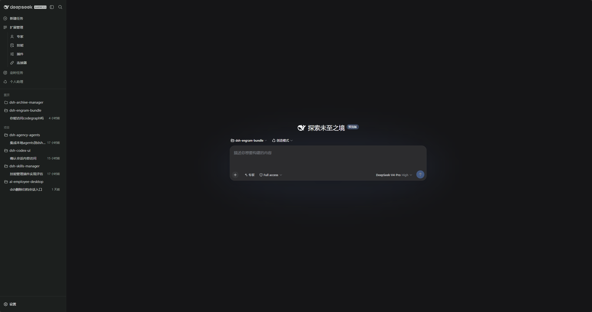
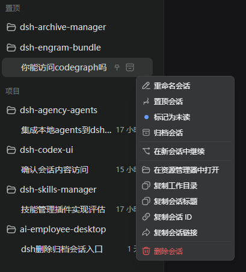
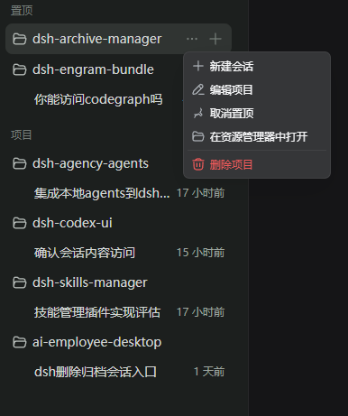
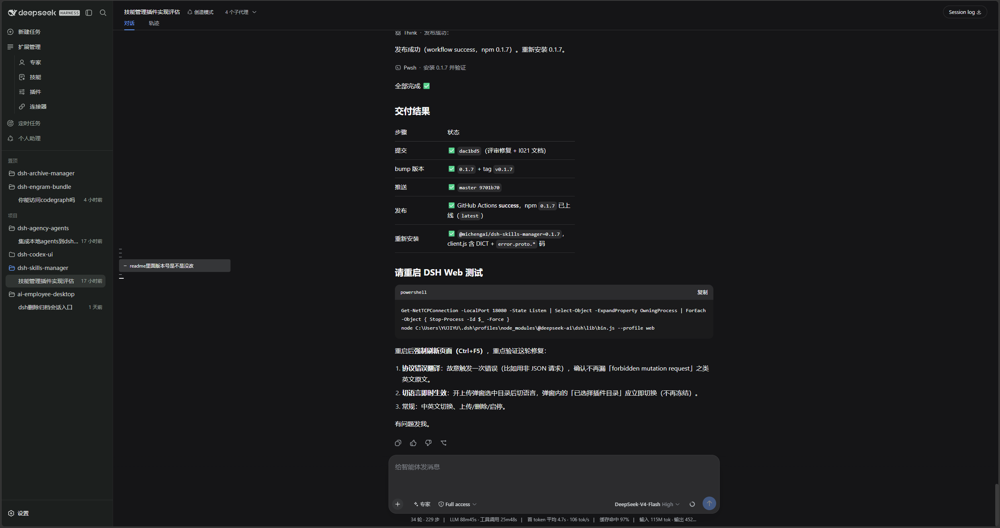
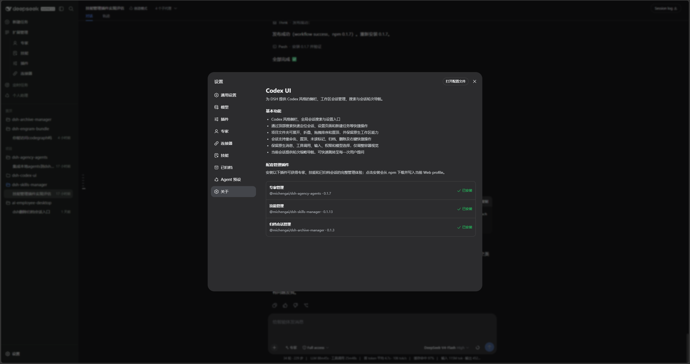

<p align="center">
  
</p>

<h1 align="center">DSH Codex UI</h1>

<p align="center">
  <strong>为 DeepSeek Harness Web 提供 Codex 风格侧栏、工作区会话树、全局搜索和轮次导航的独立插件。</strong>
</p>

<p align="center">
  <a href="https://github.com/MichengAI/dsh-codex-ui/issues">反馈问题</a>
  · <a href="https://www.npmjs.com/package/@michengai/dsh-codex-ui">查看 npm</a>
  · <a href="README.md">English</a>
</p>

<p align="center">
  <a href="LICENSE"></a>
  <a href="https://www.npmjs.com/package/@michengai/dsh-codex-ui"></a>
  
  
</p>

> DSH Codex UI 是社区维护的插件，并非 DeepSeek AI 官方产品。它只使用 DSH 公开插槽，不修改宿主源码或会话数据。

## 功能概览

- 通过官方 `sidebar` 插槽替换默认侧栏，并保留 `sidebar.workspaces`、`sidebar.settings` 和 `sidebar.footer.action`。
- 提供 Codex 风格顶栏：品牌标识、侧栏折叠和全局搜索。
- 工作区与会话支持展开折叠、拖拽排序、项目置顶、未读圆点和运行状态。
- 项目和会话菜单支持重命名、置顶、未读、归档、派生、打开目录、复制和删除。
- 调整会话列与输入卡片视觉，并为当前会话提供紧凑轮次导航。
- 在设置中提供连接器目录和「关于」页，展示配套插件安装状态。



## 前置条件

- 已可正常运行 DeepSeek Harness Web，且可在 PowerShell 中使用 `dsh`。
- 以下示例使用 `web` profile；请替换为实际目标 profile。
- 从源码安装或二次开发需要 Node.js 22+ 与 pnpm；仅从 npm 安装无需在任意目录执行 `pnpm install`。

## 安装

### 从 npm 安装

在任意 PowerShell 目录执行。请通过 `dsh plugin` 安装到 DSH profile：

```powershell
[Console]::OutputEncoding = [System.Text.Encoding]::UTF8
$OutputEncoding = [System.Text.Encoding]::UTF8
dsh plugin --profile web add @michengai/dsh-codex-ui
dsh --profile web --dump-config
```

安装或升级后重启 DSH Web，并硬刷新浏览器。插件会通过 `cordis.patch.yml` 接管默认侧栏；卸载后默认侧栏会恢复。若镜像未同步最新版本，可在安装命令末尾追加 `--registry=https://registry.npmjs.org/`。

### 安装完整套件

需要同时安装 Codex UI、专家、技能和归档会话管理时，待 `@michengai/dsh-codex-suite` 发布到 npm 后执行：

```powershell
[Console]::OutputEncoding = [System.Text.Encoding]::UTF8
$OutputEncoding = [System.Text.Encoding]::UTF8
dsh plugin --profile web add @michengai/dsh-codex-suite
dsh --profile web --dump-config
```

独立安装和聚合安装互斥。同一 profile 不要同时安装两者。切换为套件前，先卸载已单独安装的四个插件。

### 从源码安装

适用于调试或使用未发布改动。克隆后的目录会直接作为插件安装路径：

```powershell
[Console]::OutputEncoding = [System.Text.Encoding]::UTF8
$OutputEncoding = [System.Text.Encoding]::UTF8
Set-Location D:\Repository\deepseek-harness-plugin
git clone https://github.com/MichengAI/dsh-codex-ui.git
Set-Location .\dsh-codex-ui
pnpm install --frozen-lockfile
pnpm build
dsh plugin --profile web add .
dsh --profile web --dump-config
```

完成后重启 DSH Web 并硬刷新浏览器。不要手工复制 `dist`；本地目录安装会同时读取包信息和 `cordis.patch.yml`。

## 使用

打开 DSH Web 后，左侧导航即由本插件渲染。

| 目标 | 操作 |
| --- | --- |
| 新建会话 | 点击「新建任务」，或使用项目中的「+」/「新建会话」。 |
| 查找会话或设置 | 使用顶栏搜索，选择会话、设置页或快捷操作。 |
| 折叠侧栏 | 使用顶栏面板按钮。折叠后展开入口保留在窄轨顶部。 |
| 置顶项目 | 拖到「置顶」区域，或在项目菜单中选择「置顶项目」。 |
| 管理会话 | 打开会话菜单，进行重命名、置顶、未读、归档、派生、复制或删除。 |
| 跳转轮次 | 使用当前会话左侧的轮次刻度跳转到对应提问。 |
| 查看连接器 | 打开「设置 → 连接器」。不会展示地址、命令或凭证。 |
| 查看配套插件 | 打开「设置 → 关于」，查看专家、技能和归档插件状态。 |









删除项目注册不会删除项目目录或会话记录。置顶和未读状态只保存在当前浏览器。

## 持久化与安全边界

| 数据 | 存储位置 | 范围 |
| --- | --- | --- |
| 置顶项目 | `localStorage` 键 `dsh-codex-ui.pinned-workspace-ids` | 仅当前浏览器 |
| 置顶会话 | `localStorage` 键 `dsh.session-pins.v1` | 仅当前浏览器 |
| 未读会话 | `localStorage` 键 `dsh.session-unread.v1` | 仅当前浏览器 |
| 会话记录 | DSH 宿主服务 | 本插件不改写 |

- 本插件只使用 DSH 公开插槽和服务。
- 不修改宿主源码或会话数据模型。
- 归档会话的永久删除由 `@michengai/dsh-archive-manager` 提供。
- 专家和技能管理分别由对应可选 peer 插件提供。
- 连接器目录不会展示地址、命令或凭证。

## 配套插件

| 插件 | npm 包 | 作用 |
| --- | --- | --- |
| 专家管理 | `@michengai/dsh-agency-agents` | 从「专家」进入对应设置页 |
| 技能管理 | `@michengai/dsh-skills-manager` | 从「技能」进入对应设置页 |
| 归档管理 | `@michengai/dsh-archive-manager` | 提供永久删除和已归档会话管理 |
| 套件 | `@michengai/dsh-codex-suite` | 一次安装上述四个插件 |

## 二次开发

- [src\index.ts](src/index.ts)：Host 入口，以及不含敏感信息的连接器目录接口。
- [src\client\index.ts](src/client/index.ts)：客户端入口，注册侧栏、工作区树、轮次导航和设置分区。
- [src\client\CodexSidebar.tsx](src/client/CodexSidebar.tsx)：侧栏壳、搜索面板和视觉样式。
- [src\client\CodexWorkspaceBrowser.tsx](src/client/CodexWorkspaceBrowser.tsx)：工作区和会话交互。
- `tests\*.assert.ts` 与 `tests\*.spec.ts`：交互、样式和运行时集成验证。

修改 `src` 后重新构建、测试，并以本地目录安装验证：

```powershell
[Console]::OutputEncoding = [System.Text.Encoding]::UTF8
$OutputEncoding = [System.Text.Encoding]::UTF8
pnpm build
pnpm test
dsh plugin --profile web add .
```

新增功能应复用已有 DSH 插槽和公开服务；不要依赖宿主私有 DOM 或写入会话数据。

## 验证

```powershell
[Console]::OutputEncoding = [System.Text.Encoding]::UTF8
$OutputEncoding = [System.Text.Encoding]::UTF8
pnpm build
pnpm test
```

## 文档与许可证

项目状态、技术架构和迭代记录从[文档交接入口](docs/00-交接入口/00-阅读导航.md)开始。

本项目采用 [Apache License 2.0](LICENSE)。会话管理工作流参考 [Semidia/dsh-session-manager](https://github.com/Semidia/dsh-session-manager)，但本插件独立通过 DSH 公开插槽和服务实现。
